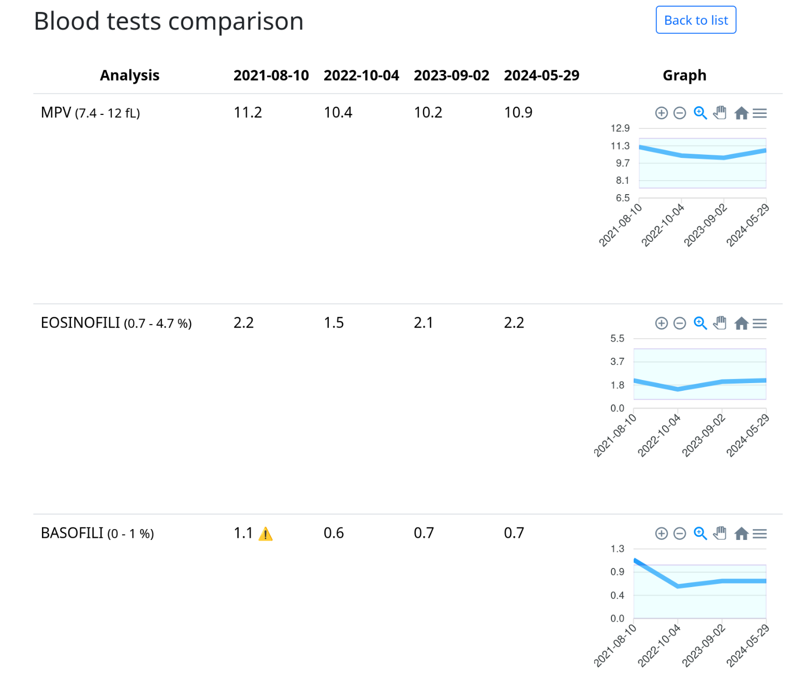

# Blood-Tests-App

This web application allows users to upload blood test results, either as PDF files or by manually entering values, and
visualize trends over time through interactive graphs.

Below is an example of the comparison page displaying graphs for some blood test results:

<kbd>  </kbd>

## Development

### Prerequisites

Ensure you have the following installed on your system:

- **Ruby** 3.4.2
- **Bundler** (dependency manager for Ruby)
- **Docker Compose** (for managing the database)

You can install the specific version of Ruby using tools like [RVM](https://rvm.io/)
or [rbenv](https://github.com/rbenv/rbenv).

### Setup

1. Install the gem dependencies:

    ```shell
    bundle install
    ```

2. Start the PostgreSQL database using Docker Compose:

    ```shell
    docker compose up -d
    ```

3. Initialize the database:

    ```shell
    rails db:create
    ```

4. Apply the database migrations:

    ```shell
    rails db:migrate
    ```

5. Start the Rails server:

    ```shell
    rails s
    ```

   Optionally, you can start both the Rails server and the Dart Sass watcher using the provided script:

    ```shell
    bin/dev
    ```

### External Service

To enable PDF uploads, ensure the [Blood-Tests-Extractor service](https://github.com/robertoz-01/blood-tests-extractor)
is running. Follow the setup instructions in
its [README](https://github.com/robertoz-01/blood-tests-extractor/blob/main/README.md#development).

## Usage

Once the application is running, access it in your web browser by
visiting: [http://localhost:3000](http://localhost:3000).


## License

This project is licensed under the [BY-NC-SA 4.0 License](LICENSE.md).